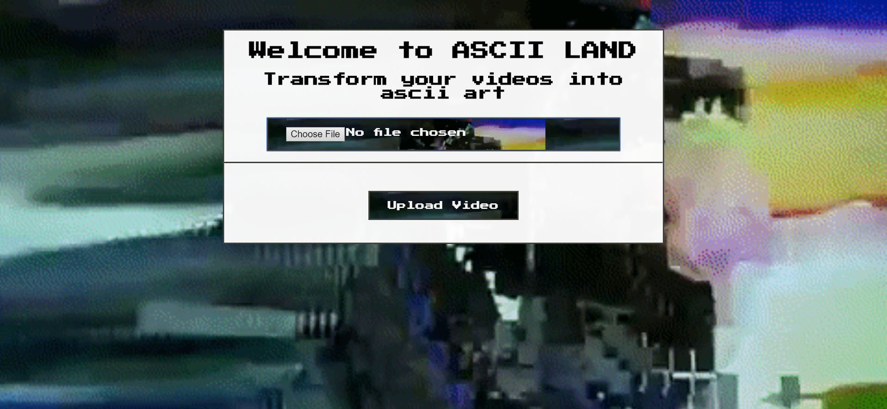
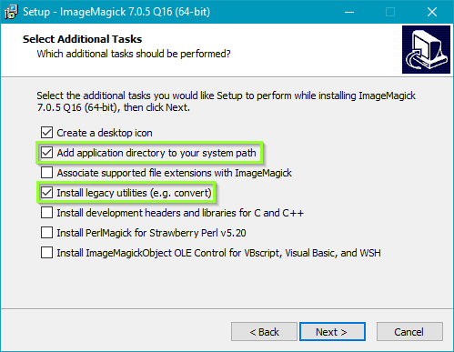

# Ascii Land

## By **Eliza Sohn, George Acosta, Jay Winebrenner, and Chris Sanchez**

Ascii Land is a... 



## Setup/Installation Requirements


### Zip:

1. Click [here](https://github.com/eliza85/ascii_group_project.git) to go to the repository location where you will find the clone/download menu.

 2. Navigate to the directory (folder) that contains your browser's downloads.
 3. Double-click on **Ascii Land** directory (folder).
 4. Open directory contents by extracting/unzipping documents from folder.
 5. Make sure your system has `Ruby 2.6.5`, `Rails 5.2.4.1` or higher, and `NPM` installed.

##### Mac OS Installation

On OS X with Homebrew, install ImageMagick:

```sh
brew install imagemagick@6
```
 1. If any errors occur here. Refer to **Troubleshooting** below these instructions.
 2. With your tools installed, and within the folder, run `bundle install` . Make sure all gems install correctly before moving on.
 3. Next run `rake db:create` , `rake db:migrate` , and `rake db:test:prepare` . Make sure all processes complete successfully.
 4. Finally, run `rails s` or `rails server` and navigate to `localhost:3000` to use **Ascii Land**.

##### Windows OS Installation

To install ImageMagick on Windows OS, use the [offical link](https://www.imagemagick.org/script/download.php#windows) on ImageMagick's website. Navigate to version `ImageMagick 6.9.6-0 Q16 x64 2016-10-02`.  
**The most crucial steps during installation of ImageMagick on Windows is to check the following two options:** 
1. **Add application directory to your system path** – otherwise Windows won’t recognize any of the commands and tell you something like ‘convert’ is not recognized as an internal or external command, operable program or batch file.

2. **Install legacy utilities** – the new version of ImageMagick got rid of the old convert and mogrify commands in favour of a single command. Checking this box will allow you to still use the old convert and mogrify commands.



 1. With your tools installed, and within the folder, run `bundle install` . Make sure all gems install correctly before moving on.
 2. Next run `rake db:create` , `rake db:migrate` , and `rake db:test:prepare` . Make sure all processes complete successfully.
 3. Finally, run `rails s` or `rails server` and navigate to `localhost:3000` to use **Ascii Land**.

- - -

## Specifications

- - -

## Technologies Used

 - Ruby 2.6.5
 - Rails 5.2.4.1
 - PostgreSQL 12.1
 - Active Storage
 - Database Querying
 - ffmpeg
 - ImageMagick

- - -

## Troubleshooting

#### Can't install RMagick. Can't find libMagick or one of the dependent libraries. Check the mkmf.log file for more detailed information

Typically this message means that one or more of the libraries that ImageMagick
depends on hasn't been installed. Examine the mkmf.log file in the ext/RMagick
subdirectory of the installation directory for any error messages. These
messages typically contain enough additional information for you to be able to
diagnose the problem. Also see [this FAQ](https://web.archive.org/web/20131206133600/http://rmagick.rubyforge.org/install-faq.html#libmagick).

On OS X with Homebrew, try (re)installing pkg-config:

```sh
brew uninstall pkg-config
brew install pkg-config
brew unlink pkg-config
brew link pkg-config
```
- - -

### Support and Contact

If you run into any issues running **Ascii Land**, please contact **Chris Sanchez**.

### License

Permission is hereby granted, free of charge, to any person obtaining a copy of this software and associated documentation files (the "Software"), to deal in the Software without restriction, including without limitation the rights to use, copy, modify, merge, publish, distribute, sublicense, and/or sell copies of the Software, and to permit persons to whom the Software is furnished to do so, subject to the following conditions:

The above copyright notice and this permission notice shall be included in all copies or substantial portions of the Software.

THE SOFTWARE IS PROVIDED "AS IS", WITHOUT WARRANTY OF ANY KIND, EXPRESS OR IMPLIED, INCLUDING BUT NOT LIMITED TO THE WARRANTIES OF MERCHANTABILITY, FITNESS FOR A PARTICULAR PURPOSE AND NON-INFRINGEMENT. IN NO EVENT SHALL THE AUTHORS OR COPYRIGHT HOLDERS BE LIABLE FOR ANY CLAIM, DAMAGES OR OTHER LIABILITY, WHETHER IN AN ACTION OF CONTRACT, TORT OR OTHERWISE, ARISING FROM, OUT OF OR IN CONNECTION WITH THE SOFTWARE OR THE USE OR OTHER DEALINGS IN THE SOFTWARE.

Copyright (c) 2020 **Eliza Sohn, George Acosta, Jay Winebrenner, or Chris Sanchez**

